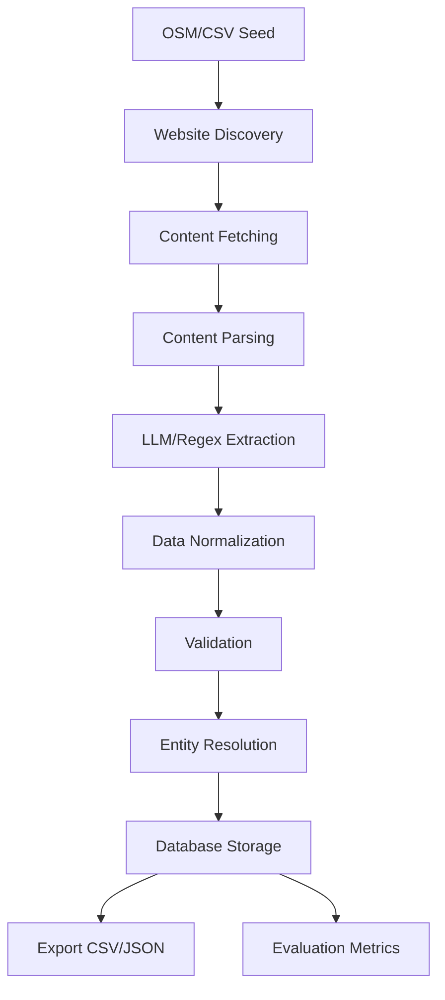

# Bharat Resto MVP 🇮🇳🍛

A comprehensive AI-powered pipeline for discovering, extracting, and validating Indian restaurant data from open sources including OpenStreetMap (OSM), official websites, and PDF documents. Built with Python 3.11+ and designed for local-first operation using only open-source tools.

---

## 🚀 Quick Start & Setup

### Prerequisites

- Python 3.11+
- [Ollama](https://ollama.ai/) (optional, for LLM-based extraction)
- Internet connection for OSM data
- 8GB+ RAM (if using LLM)

### Installation

1. **Clone the repository**:
   ```bash
   git clone <repository-url>
   cd bharat-resto-mvp
   ```

2. **Create and activate virtual environment**:
   ```bash
   python -m venv venv
   source venv/bin/activate  # On Windows: venv\Scripts\activate
   ```

3. **Install dependencies**:
   ```bash
   pip install -r requirements.txt
   ```

4. **Setup Ollama** (optional, for AI-powered extraction):
   ```bash
   curl -fsSL https://ollama.ai/install.sh | sh
   ollama pull llama2
   ```

5. **Configure environment** (optional):
   ```bash
   cp .env.example .env
   # Edit .env with your preferences
   ```

---

## 📚 Table of Contents

- [Features](#features)
- [Project Structure](#project-structure)
- [Configuration](#configuration)
- [Usage Options](#usage-options)
- [Architecture](#architecture)
- [Agent Definitions](#agent-definitions)
- [Execution Plan](#execution-plan)
- [Data Schema](#data-schema)
- [Testing](#testing)
- [Development](#development)
- [Production Deployment](#production-deployment)
- [Monitoring & Analytics](#monitoring--analytics)
- [Troubleshooting](#troubleshooting)
- [References](#references)
- [License](#license)
- [Contributing](#contributing)
- [Support](#support)

---

## 🌟 Features

- Multi-source data collection: OSM, restaurant websites, PDF menus
- Local LLM integration (Ollama)
- Robust data pipeline: Fetch → Parse → Extract → Normalize → Validate → Store
- Entity resolution: Deduplication using name similarity and geospatial hashing
- Comprehensive validation for Indian restaurant data
- Export capabilities: CSV, JSON with provenance tracking
- Evaluation framework: Metrics against gold standard dataset
- Production ready: Type hints, logging, error handling
- FastAPI-powered REST API with interactive frontend
- Docker support

---

## 🏗️ Project Structure

```
bharat-resto-mvp/
├── app/
│   ├── cli.py
│   ├── config.py
│   ├── persist.py
│   ├── seed.py
│   ├── discover.py
│   ├── fetch.py
│   ├── parse.py
│   ├── extract/
│   ├── normalize.py
│   ├── validate.py
│   ├── geocode.py
│   ├── resolve.py
│   ├── export.py
│   ├── eval.py
│   ├── log.py
│   └── utils.py
├── data/
├── exports/
├── tests/
├── .env.example
├── pyproject.toml
└── README.md
```

---

## 🔧 Configuration

### Environment Variables

Create a `.env` file or set variables in your shell:

```bash
# Database
BHARAT_RESTO_DB_PATH="./data/restaurants.db"
BHARAT_RESTO_DATA_DIR="./data"
BHARAT_RESTO_EXPORT_DIR="./exports"

# LLM Settings
BHARAT_RESTO_LLM_ENABLED="true"
BHARAT_RESTO_OLLAMA_BASE_URL="http://localhost:11434"
BHARAT_RESTO_OLLAMA_MODEL="llama2"

# Web Server
BHARAT_RESTO_HOST="127.0.0.1"
BHARAT_RESTO_PORT="8000"
BHARAT_RESTO_RELOAD="true"
```

---

## 🚦 Usage Options

### 1. Web Interface (Recommended)

Start the FastAPI web server:

```bash
python -m app.cli serve --reload
open http://localhost:8000
```

### 2. Command Line Interface

Run the complete pipeline:

```bash
python -m app.cli run --city blr --limit 10
python -m app.cli run --city blr --limit 50 --llm
python -m app.cli export --format csv
python -m app.cli status
python -m app.cli validate
```

### 3. Docker Deployment

```bash
docker-compose up -d
open http://localhost:8000
docker-compose logs -f
```

---

## 🏗️ Architecture

### High-Level Data Flow



---

## 🤖 Agent Definitions

| Agent         | Role / Responsibilities                                      | File(s)                |
|---------------|-------------------------------------------------------------|------------------------|
| Seed          | OSM/CSV data collector                                      | `app/seed.py`          |
| Discovery     | Website finder                                              | `app/discover.py`      |
| Fetch         | Content downloader (HTML/PDF)                               | `app/fetch.py`         |
| Parse         | Content processor (HTML/PDF/OCR)                            | `app/parse.py`         |
| Extract       | LLM/regex-based data extraction                             | `app/extract/`         |
| Normalize     | Data standardization                                        | `app/normalize.py`     |
| Validate      | Business rules validation                                   | `app/validate.py`      |
| Geocode       | Address to coordinates                                      | `app/geocode.py`       |
| Resolve       | Deduplication/entity resolution                             | `app/resolve.py`       |
| Export        | CSV/JSON export                                             | `app/export.py`        |
| Evaluation    | Quality metrics                                             | `app/eval.py`          |

---

## 📋 Execution Plan

### Typical Workflow

```bash
# 1. Seed from OSM
bharat-resto seed-cmd --city blr --limit 50

# 2. Discover websites
bharat-resto discover-cmd --city blr

# 3. Fetch web content
# (Automatically executed in full pipeline)

# 4. Parse and extract data
# (Automatically executed in full pipeline)

# 5. Normalize and validate
# (Automatically executed in full pipeline)

# 6. Geocode and resolve duplicates
# (Automatically executed in full pipeline)

# 7. Export results
bharat-resto export-cmd --format csv

# 8. Quality evaluation
bharat-resto eval-cmd
```

Or run all phases in sequence:

```bash
bharat-resto run --city blr --limit 100 --llm
```

---

## 🗃️ Data Schema

### Core Restaurant Entity

```json
{
  "restaurant_id": "resto_blr_001",
  "canonical_name": "Mavalli Tiffin Room",
  "address_full": "14, Lalbagh Rd, Mavalli, Bengaluru, Karnataka",
  "pincode": "560004",
  "lat": 12.9352,
  "lon": 77.5869,
  "phone": "+91 80 2222 0022",
  "website": "https://mtrfood.com",
  "cuisines": ["South Indian", "Vegetarian"],
  "hours": {"mon": "06:30-22:30", ...},
  "metadata": {
    "created_at": "2025-08-24T11:42:52Z",
    "updated_at": "2025-08-24T11:42:52Z",
    "source": "osm",
    "quality_score": 0.85
  }
}
```

### Provenance Tracking

```json
{
  "provenance_id": "prov_001",
  "restaurant_id": "resto_blr_001",
  "field": "phone",
  "value": "+91 80 2222 0022",
  "confidence": 0.95,
  "source_url": "https://mtr.com/contact",
  "content_hash": "abc123...",
  "extraction_method": "llm",
  "model_name": "llama2",
  "model_version": "7b-instruct",
  "extracted_at": "2025-08-24T11:42:52Z",
  "metadata": { ... }
}
```

### Validation Results

```json
{
  "restaurant_id": "resto_blr_001",
  "is_valid": true,
  "quality_score": 0.85,
  "field_validations": { ... },
  "overall_issues": [ ... ],
  "completeness": { ... }
}
```

---

## 🧪 Testing

```bash
pytest
pytest --cov=app
pytest tests/test_extract.py
```

---

## 🔧 Development

### Setup

```bash
python -m venv venv
source venv/bin/activate
pip install -e ".[dev]"
pre-commit install
```

### Code Quality

```bash
black app/
isort app/
mypy app/
flake8 app/
```

---

## 🚀 Production Deployment

### Docker Compose

```bash
docker-compose up -d
open http://localhost:8000
docker-compose logs -f app
docker-compose down
```

### Manual Docker Build

```bash
docker build -t bharat-resto-api .
docker run -p 8000:8000 -v $(pwd)/data:/app/data -v $(pwd)/exports:/app/exports bharat-resto-api
```

---

## 📊 Monitoring & Analytics

- Health check: `GET /health`
- System status: `GET /status`
- Logs: `docker-compose logs -f app`
- Database stats: SQL queries on `restaurants` and `provenance` tables

---

## 🛠️ Troubleshooting

| Issue | Solution |
|-------|----------|
| `command not found: bharat-resto` | Run `pip install -e .` to install the CLI |
| `Import "typer" could not be resolved` | Install dependencies: `pip install -r requirements.txt` |
| `LLM connection failed` | Use `--no-llm` flag or install Ollama |
| `No restaurants found` | Try different city or increase `--limit` |
| `Permission denied` | Check virtual environment activation |

---

## 📚 References

- [OpenStreetMap](https://www.openstreetmap.org/)
- [Overpass API](https://overpass-turbo.eu/)
- [Nominatim](https://nominatim.org/)
- [Ollama](https://ollama.ai/)
- [SQLAlchemy](https://sqlalchemy.org/)
- [Pydantic](https://pydantic.dev/)
- [Typer](https://typer.tiangolo.com/)
- [BeautifulSoup](https://www.crummy.com/software/BeautifulSoup/)

---

## 📄 License

MIT License - see LICENSE file for details.

---

## 🤝 Contributing

1. Fork the repository
2. Create a feature branch
3. Make changes with tests
4. Submit a pull request

---

## 📞 Support

- **Documentation**: This README
- **Issues**: GitHub Issues
- **Discussions**: GitHub Discussions

---

**Built with ❤️ for the Indian restaurant ecosystem**